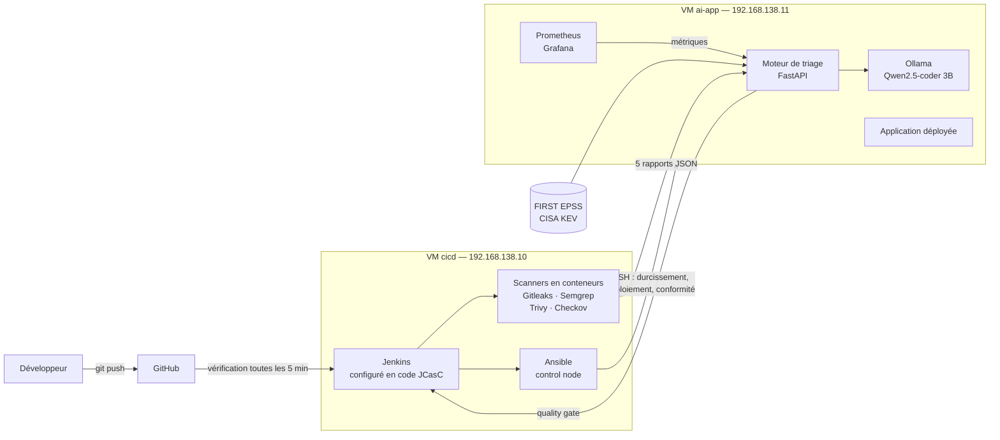
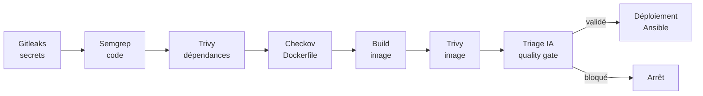

# TriageX

**Pipeline DevSecOps on-premise qui analyse le code avec 5 scanners de sécurité, trie les alertes avec une IA locale, ne déploie que le code jugé sûr, et corrige automatiquement la dérive de configuration des serveurs.**

Projet personnel réalisé sur 2 machines virtuelles, entièrement provisionnées et durcies par Ansible. Aucun service cloud, aucun coût : le code analysé ne quitte jamais l'infrastructure.

---

## Le problème

Les outils de sécurité produisent trop d'alertes pour être exploitables. Sur l'application de démonstration du projet, **environ 150 lignes de code génèrent 583 alertes brutes**. Face à ce volume, les équipes finissent par ignorer les alertes, et les vraies failles passent en production. En parallèle, les serveurs s'éloignent de leur configuration sécurisée au fil des interventions manuelles, sans que personne ne s'en aperçoive.

## Résultats

Mesures réelles, issues des rapports archivés par Jenkins.

| Mesure | Résultat |
|---|---|
| Alertes brutes des 5 scanners (build initial) | **583** |
| Alertes à traiter après triage (critiques et hautes) | **10**, soit **98,3 % de réduction** |
| Alertes brutes après les corrections du scénario | **31**, soit **95 % de moins** que le build initial |
| Vulnérabilités de l'image Docker | **535 → 9** après passage à une image Alpine récente |
| Vulnérabilités des dépendances | **23 → 2** après mise à jour |
| Problèmes de Dockerfile (Checkov) | **4 → 0** |
| Durée du triage IA | 3 à 6 minutes, sur processeur, modèle local |
| Failles réelles masquées par l'IA | **0**, impossible par conception |
| Dérive de configuration simulée | **2 modifications sur 2** détectées et corrigées automatiquement |
| Déploiement | automatique uniquement si le quality gate est validé ; build 16 en production |

### Scénario de démonstration en 3 builds

| Build | Changement | Alertes brutes | Image | Dépendances | Dockerfile | Résultat |
|---|---|---|---|---|---|---|
| 14 | État initial | 583 | 535 | 23 | 4 | **Bloqué** : secret dans le code, et faille SQLite CVE-2025-6965 (EPSS 0,71 : 71 % de probabilité d'exploitation) |
| 15 | Secret retiré | 582 | 535 | 23 | 4 | **Bloqué** : faille SQLite de l'image `python:3.8-slim`, en fin de vie |
| 16 | Image `python:3.13-alpine`, dépendances à jour, utilisateur non-root, gunicorn | **31** | **9** | **2** | **0** | **Validé et déployé automatiquement** (`triagex-demo:16`) |

Au build 16, le triage ramène les 31 alertes à **6 à traiter**, toutes de priorité haute : ce sont les failles volontaires du code de démonstration (injection SQL, `eval`...), signalées mais non bloquantes, car le quality gate ne bloque que le critique.

---

## Architecture



Les deux machines sont configurées, durcies et maintenues conformes par Ansible. Une seule commande (`ansible-playbook site.yml`) reconstruit l'ensemble de l'environnement.

## Le pipeline

Le pipeline Jenkins s'exécute à chaque push. Il est décrit en code dans le `Jenkinsfile`, et le job lui-même est créé automatiquement par Ansible et Jenkins Configuration as Code.



Chaque scanner tourne dans un conteneur jetable, avec l'identité de l'utilisateur Jenkins. Le quality gate ne bloque que les risques **réellement critiques** : un secret dans le code, une vulnérabilité exploitée activement (catalogue CISA KEV), ou une vulnérabilité grave très probablement exploitée (score EPSS élevé).

## Le moteur de triage

Le moteur reçoit les 5 rapports et le code source, puis :

1. **normalise** les alertes dans un format commun ;
2. **déduplique** : une même CVE dans plusieurs paquets système, une même bibliothèque vue par deux scanners, ou plusieurs règles sur la même ligne ne comptent qu'une fois ;
3. **enrichit** chaque CVE avec son score **EPSS** (probabilité d'exploitation, FIRST) et sa présence dans le catalogue **CISA KEV** ;
4. **demande un second avis à une IA locale** (Ollama, Qwen2.5-coder 3B) sur chaque alerte de code : explication et correctif proposé ;
5. **calcule un score de risque réel** et produit un rapport HTML publié dans Jenkins.

### Ce que l'évaluation de l'IA a appris

L'IA a été mesurée sur une application d'examen contenant **13 vraies failles et 7 pièges** (du code qui ressemble à une faille mais qui est sûr), sans aucun indice dans le code. La correction est dans `evaluation/ground_truth.json`, que l'IA ne voit jamais, et le script `scripts/evaluate_ai.py` note l'IA à chaque build.

| Version | Modèle | Constat |
|---|---|---|
| Prompt simple | Llama 3.2 3B | A masqué une injection SQL et une injection de commande |
| Seuil de confiance | Llama 3.2 3B | A masqué une injection SQL avec une confiance déclarée de 1.0 |
| Modèle spécialisé code | Qwen2.5-coder 3B | Verdicts justes sur les 3 failles de la première application de démo |
| Examen avec pièges | Qwen2.5-coder 3B | Reconnaît toutes les vraies failles (11 sur 11, puis 10 sur 10 sans le secret), mais aucun piège (0 sur 3) : il confirme tout |

**Conclusion :** un petit modèle local n'est pas assez fiable pour décider seul en sécurité, et sa confiance déclarée ne veut rien dire. TriageX en tire trois règles :

- **l'IA ne masque jamais une alerte** : elle confirme ou conteste, mais tout reste visible ;
- **une faille grave n'est jamais rétrogradée** sur le seul avis de l'IA, et un secret reste toujours critique ;
- **l'IA n'analyse que le code** : les CVE des bibliothèques sont classées par des données fiables (sévérité, EPSS, KEV, correctif disponible), car le modèle les rejetait toutes à tort.

La réduction de 583 à 10 alertes vient donc du triage déterministe (déduplication, EPSS, KEV, sévérité) ; l'IA apporte les explications et les correctifs. Un modèle plus grand distinguerait mieux les pièges, mais demanderait plus de mémoire, ou un service cloud qui ferait sortir le code de l'infrastructure.

## Sécurité de l'infrastructure

Appliquée par le rôle Ansible `hardening`, inspiré des CIS Benchmarks :

- SSH par clé uniquement, connexion root interdite ;
- pare-feu UFW : tout est refusé en entrée sauf les ports nécessaires, certains ports n'étant ouverts qu'à une machine précise ;
- fail2ban contre la force brute, auditd pour la traçabilité, mises à jour de sécurité automatiques, paramètres réseau du noyau durcis ;
- secrets chiffrés avec Ansible Vault, jamais en clair dans le dépôt ;
- conteneurs durcis : utilisateur non-root, système de fichiers en lecture seule, aucune capacité Linux, `no-new-privileges`, mémoire limitée ;
- services internes (Ollama, Prometheus) liés à `127.0.0.1`, moteur IA accessible uniquement depuis le serveur CI.

## Conformité nocturne

Le job Jenkins `triagex-compliance` s'exécute chaque nuit :

1. il supprime les règles de pare-feu non autorisées (les règles SSH ne sont jamais supprimées automatiquement) ;
2. il réapplique le durcissement : le nombre de corrections nécessaires mesure la **dérive** ;
3. il vérifie au second passage que plus rien n'est à corriger, et contrôle la configuration SSH effective.

Le build passe en orange quand une dérive a été corrigée. Résultat mesuré :

| Contrôle | Situation | Dérive corrigée | Résultat |
|---|---|---|---|
| 1 | Serveurs conformes | 0 | Vert |
| 2 | Port 4444 ouvert à la main et fail2ban arrêté sur ai-app | **2** | Orange, puis conforme au second passage |

## Déploiement

Quand le quality gate est validé, Jenkins exporte **l'image exactement telle qu'elle a été analysée** par Trivy, et Ansible la charge sur ai-app sans la reconstruire. Un contrôle de santé vérifie l'application ; en cas d'échec, Ansible remet automatiquement la version précédente.

L'application de démonstration est volontairement vulnérable. Son conteneur est donc enfermé (non-root, lecture seule, aucune capacité, processus et mémoire limités) et placé sur un réseau Docker isolé des services internes de la machine.

## Supervision

Prometheus et Grafana, déployés par Ansible, avec deux tableaux de bord provisionnés en code :

- **Serveurs** : disponibilité, CPU, mémoire, disque et swap des deux machines ;
- **Sécurité du pipeline** : alertes brutes et à traiter build après build, priorités, avis de l'IA, quality gate, dérive corrigée, version en production.

<!-- Captures d'écran conseillées : ajouter docs/images/grafana-securite.png, docs/images/jenkins.png et docs/images/rapport.png, puis les référencer ici. -->

---

## Stack technique

| Domaine | Outils |
|---|---|
| Infrastructure | VMware Workstation, Ubuntu Server, Ansible (rôles, Vault) |
| CI/CD | Jenkins (Jenkinsfile, Configuration as Code, Job DSL) |
| Conteneurs | Docker |
| Sécurité | Gitleaks, Semgrep, Trivy, Checkov, UFW, fail2ban, auditd |
| IA | Ollama, Qwen2.5-coder 3B, Python, FastAPI |
| Données de risque | FIRST EPSS, catalogue CISA KEV |
| Supervision | Prometheus, Grafana, node_exporter |
| Tests | pytest (moteur de triage et script d'évaluation) |

## Structure du dépôt

```
triagex/
├── Jenkinsfile                 # pipeline DevSecOps
├── Jenkinsfile.compliance      # contrôle de conformité nocturne
├── ansible/
│   ├── site.yml                # construit tout l'environnement
│   ├── compliance.yml          # détection et correction de la dérive
│   ├── deploy-app.yml          # déploiement avec contrôle de santé et retour arrière
│   ├── group_vars/             # variables (secrets chiffrés avec Vault)
│   └── roles/                  # common, hardening, docker, jenkins, security-tools,
│                               # ollama, ai-engine, node-exporter, monitoring
├── ai-engine/                  # moteur de triage (FastAPI) et ses tests
├── scripts/
│   ├── triage_client.py        # appelé par Jenkins, applique le quality gate
│   └── evaluate_ai.py          # examen de l'IA
├── evaluation/ground_truth.json  # correction de l'examen
├── demo-app/                   # application volontairement vulnérable
└── demo-steps/                 # version corrigée utilisée dans le scénario
```

## Installation

Prérequis : deux VMs Ubuntu Server (4 Go de RAM chacune) sur un même réseau privé, un utilisateur `devops` avec sudo et clé SSH, et Ansible sur la machine CI.

```bash
git clone https://github.com/BouchraCloudx/triagex.git
cd triagex/ansible

# Mot de passe Vault, hors du dépôt
echo 'mot-de-passe-vault' > ~/.vault_pass && chmod 600 ~/.vault_pass

# Secrets chiffrés
ansible-vault create group_vars/ci_servers/vault.yml   # vault_jenkins_admin_password
ansible-vault create group_vars/ai_servers/vault.yml   # vault_grafana_admin_password

ansible all -m ping
ansible-playbook site.yml
```

Adapter les adresses IP dans `inventory.ini`, `inventory-jenkins.ini` et `group_vars/`.

| Service | Adresse |
|---|---|
| Jenkins | http://192.168.138.10:8080 |
| Grafana | http://192.168.138.11:3001 |
| Application déployée | http://192.168.138.11:3000 |

## Limites et pistes d'amélioration

- **Précision de l'IA** : le modèle de 3 milliards de paramètres ne distingue pas les fausses alertes ; un modèle plus grand demanderait plus de mémoire. L'échantillon de l'examen reste petit (une vingtaine d'alertes).
- **Couverture des scanners** : Semgrep (règles `p/python`) n'a détecté que 8 des 13 fonctions vulnérables de l'examen (traversée de répertoire, redirection ouverte, `pickle`, `yaml.load` et `mktemp` manqués) ; d'autres jeux de règles pourraient être ajoutés.
- **Niveau du quality gate** : seul le critique bloque ; les failles hautes du code restent signalées sans bloquer.
- **Création des VMs** : manuelle ; Terraform ou Vagrant la rendraient reproductible.
- **Versions des images** : les scanners utilisent le tag `latest` ; les fixer rendrait les résultats reproductibles.
- **Jenkins** dispose de la clé SSH et du mot de passe Vault : c'est le composant le plus sensible de la chaîne.

## Auteur

Bouchra — [github.com/BouchraCloudx](https://github.com/BouchraCloudx)
